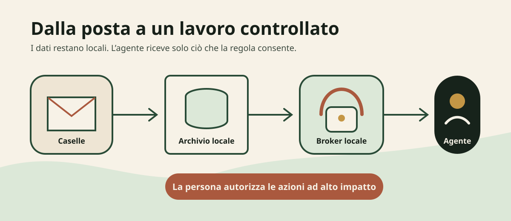
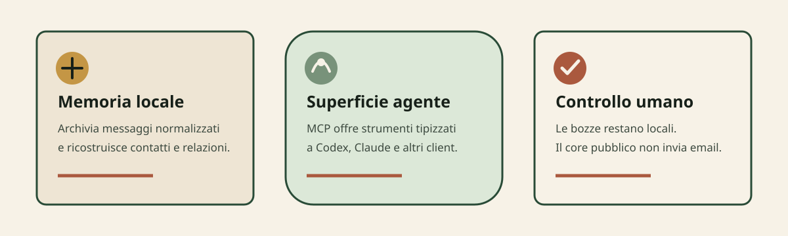
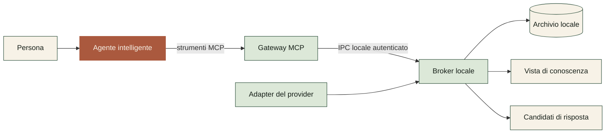
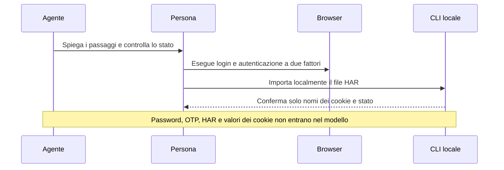

<div align="center">
  

# Work Assistant

**La posta diventa un archivio locale utilizzabile da una persona o da un agente intelligente.**

<a href="https://openai.com/codex"></a>
[](#stato-del-progetto)
[](./LICENSE)
[](#prova-la-demo)
[](#come-protegge-i-dati)
[](./docs/PLATFORMS.md)

[Prova la demo](#prova-la-demo) · [Collega un agente](#usa-work-assistant-con-un-agente) · [Come protegge i dati](#come-protegge-i-dati) · [Stato del progetto](#stato-del-progetto)
</div>

---



## Che cos'è Work Assistant

Work Assistant è un sistema locale per organizzare e usare la posta elettronica con strumenti intelligenti. Una casella contiene conversazioni, persone, allegati, decisioni e attività aperte: il sistema acquisisce i messaggi da una o più caselle, li normalizza e li conserva in un archivio SQLite locale, da cui ricostruisce una vista di contatti e interazioni.

Una persona lo usa dalla riga di comando; un agente, come Codex o Claude, lo usa tramite il protocollo MCP. Non è un client di posta tradizionale e non è una semplice skill:

- il **core** gestisce account, archivio, controlli e contenuti proposti;
- la **CLI** permette a una persona di usare il core senza un modello;
- il **server MCP** offre strumenti strutturati agli agenti;
- la **skill** insegna all'agente come usare questi strumenti entro i limiti autorizzati;
- un **adapter** collega uno specifico servizio email al core.

Il core pubblico non invia email. Le risposte preparate restano candidati locali fino a un'eventuale azione separata e autorizzata.



| Capacità | Che cosa significa |
| --- | --- |
| Memoria locale | I messaggi normalizzati restano sul computer e conservano hash di integrità. |
| Superficie per agenti | MCP espone comandi tipizzati senza consegnare al gateway l'accesso diretto all'archivio. |
| Controllo umano | Il core pubblico prepara contenuti locali, ma non espone un comando di invio. |

Work Assistant separa tre livelli: **archivio locale** (conserva e controlla), **vista di conoscenza** (derivata e rigenerabile, non un backup) e **superficie agente** (cerca, legge e prepara tramite operazioni controllate).

## Come funziona



Il broker è il confine di fiducia. Legge i dati in chiaro, applica la regola di pseudonimizzazione e restituisce al gateway solo uno schema dichiarato. Gli identificativi del provider diventano riferimenti opachi. I metadati non riconosciuti non attraversano il confine.

## Prova la demo

La demo usa solo identità e messaggi sintetici. Non richiede credenziali né una casella reale.

### Requisiti

- Python 3.11 o successivo;
- Git;
- macOS, Linux o Windows.

### 1. Installa il progetto

```bash
git clone https://github.com/Wulfgardr/work-assistant.git
cd work-assistant
python3 -m venv .venv
```

Attiva l'ambiente su macOS o Linux:

```bash
source .venv/bin/activate
```

Su Windows PowerShell:

```powershell
.venv\Scripts\Activate.ps1
```

Installa Work Assistant:

```bash
python -m pip install .
```

### 2. Avvia la demo in un colpo solo

```bash
work-assistant --config work-assistant.toml setup --demo
```

Il comando crea la configurazione con una cartella dati specifica del sistema operativo, carica la casella sintetica e controlla l'archivio. Archivio, chiavi e registro delle identità non vengono collocati nel repository. Poi esplora:

```bash
work-assistant --config work-assistant.toml list
work-assistant --config work-assistant.toml attachment-text --account personal --id p-001 --attachment-id a-001
work-assistant --config work-assistant.toml knowledge
work-assistant --config work-assistant.toml verify
work-assistant --config work-assistant.toml doctor
```

Il comando `verify` controlla l'integrità di SQLite e gli hash dei messaggi. Non dimostra che un backup possa essere ripristinato. Il comando `doctor` spiega in chiaro se qualcosa non va e come sistemarlo.

### 3. Collega caselle vere con la procedura guidata

```bash
work-assistant --config work-assistant.toml setup
```

La procedura chiede livello di riservatezza e dati delle caselle, valida ogni risposta, non stampa mai segreti e prova la sincronizzazione dove possibile. Per IMAP serve una password per le app in un file locale; per Zimbra o Carbonio un file HAR dal browser; per Microsoft 365 un client ID (vedi le sezioni sotto).

## Usa Work Assistant con un agente

Codex, Claude e altri client MCP usano la stessa superficie. Il modello non è incorporato nella CLI.

Installa il supporto MCP:

```bash
python -m pip install '.[mcp]'
```

### 1. Avvia il broker locale

Apri un terminale locale attendibile e avvia:

```bash
work-assistant --config work-assistant.toml broker
```

Il broker deve rimanere attivo. Se non è disponibile, il gateway MCP si arresta senza leggere direttamente l'archivio.

In un secondo terminale, recupera i due percorsi necessari:

```bash
work-assistant --config work-assistant.toml broker-info
```

### 2. Registra il server nel tuo client

Il modo semplice, senza segnaposto da sostituire a mano:

```bash
work-assistant --config work-assistant.toml mcp-setup --client codex --apply
```

Client supportati: `codex` e `claude-code` (con `--apply` registrano da soli), `claude-desktop` e `vscode` (mostrano il blocco JSON da copiare). Senza `--apply` mostra il comando esatto.

<details>
<summary><strong>Registrazione manuale</strong></summary>

Recupera i due valori con `broker-info`, poi sostituisci i segnaposto:

```bash
codex mcp add work-assistant -- \
  "$PWD/.venv/bin/work-assistant" \
  mcp \
  --broker-address '<BROKER_ADDRESS>' \
  --broker-auth-file '<BROKER_AUTH_FILE>'
```

Su Windows usa `.venv\Scripts\work-assistant.exe`. Per Claude Code il comando è analogo con `claude mcp add`. Per Claude Desktop, configura un server `stdio` equivalente:

```json
{
  "mcpServers": {
    "work-assistant": {
      "command": "/percorso/assoluto/work-assistant/.venv/bin/work-assistant",
      "args": [
        "mcp",
        "--broker-address",
        "<BROKER_ADDRESS>",
        "--broker-auth-file",
        "<BROKER_AUTH_FILE>"
      ]
    }
  }
}
```

</details>

Esempio di richiesta:

> Usa Work Assistant. Controlla la modalità di riservatezza, sincronizza la casella `personal`, mostrami gli ultimi messaggi e prepara un candidato di risposta. Non inviare nulla.

La skill facoltativa si trova in [`skills/work-assistant`](skills/work-assistant). La skill aggiunge regole operative, ma non sostituisce il server MCP.

## Usa la CLI senza un agente

La CLI è deterministica: non contiene un modello e non interpreta richieste in linguaggio naturale.

```bash
work-assistant --config work-assistant.toml list --account personal --limit 10
work-assistant --config work-assistant.toml show --account personal --id p-001
```

Per salvare un candidato di risposta locale:

```bash
printf 'Grazie. Verifico il documento entro venerdì.\n' > risposta.txt
work-assistant --config work-assistant.toml draft-candidate \
  --account personal \
  --to sam@example.test \
  --subject 'Re: Revisione del progetto' \
  --in-reply-to p-001 \
  --body-file risposta.txt
```

La risposta include `sent: false`. Nessun contenuto viene scritto sul provider.

Un agente con accesso a un terminale deve usare MCP. Non deve leggere direttamente SQLite né l'output in chiaro della CLI.

## Leggi gli allegati come testo derivato

Work Assistant estrae localmente il testo degli allegati. I byte originali restano dal provider: l'archivio conserva solo il testo derivato con l'hash della sorgente e il broker lo pseudonimizza prima di esporlo agli agenti.

```bash
work-assistant --config work-assistant.toml attachment-capabilities
work-assistant --config work-assistant.toml attachment-text \
  --account personal --id p-001 --attachment-id a-001
```

Gli estrattori `builtin-text` e `builtin-html` sono sempre disponibili. Per documenti Office, EPUB, RTF, CSV e PDF con livello di testo installa il supporto facoltativo AnyDoc, che lavora in locale senza chiavi né rete:

```bash
python -m pip install '.[attachments]'
```

Quando un documento non ha un livello di testo utilizzabile, il sistema usa il fallback OCR locale tramite il binario `tesseract`, se presente (per i PDF scansionati le pagine vengono prima rese in immagini con `pdftoppm`, se presente; `ocr_mode = "off"` disabilita tutto). I servizi OCR ospitati restano fuori ambito: invierebbero contenuti a terzi. Lo stato di ogni lettura (`ok`, `needs_ocr`, `ocr_unavailable`, `unsupported`, `provider_unsupported`) è sempre visibile, anche via MCP con `mail_attachment_capabilities` e `mail_attachment_text`.

Limiti e comportamento si configurano nella sezione `[attachments]` di `work-assistant.toml`. La pseudonimizzazione del contenuto binario resta non disponibile: ciò che attraversa il broker è solo testo derivato.

## Configura più caselle

Ogni tabella sotto `[accounts]` descrive una casella indipendente (chi preferisce le domande guidate usi `work-assistant setup`):

```toml
schema_version = 1
data_dir = "/percorso/esterno/al/repository"

[privacy]
mode = "all"
default_action = "pseudonymize"

[accounts.personal]
provider = "demo"
source = "./examples/demo-mailbox.jsonl"
address = "alex@example.test"

[accounts.team]
provider = "demo"
source = "./examples/team-mailbox.jsonl"
address = "team@example.test"
```

Il repository include gli adapter integrati `demo` (fixture JSONL sintetiche), `maildir` (cartella Maildir locale, senza rete) e `imap` (IMAP generico, solo TLS, con password in file segreto). Gli adapter reali devono implementare il contratto descritto in [`docs/PROVIDER_ADAPTERS.md`](docs/PROVIDER_ADAPTERS.md) e registrarsi nel gruppo di entry point `work_assistant.providers`.

```toml
[accounts.local]
provider = "maildir"
path = "/percorso/locale/Maildir"
address = "alex@example.test"
```

### Zimbra e Carbonio

La versione pubblica include un onboarding locale per preparare una sessione Zimbra o Carbonio da un file HAR, più un adapter sperimentale di sola lettura in [`adapters/zimbra`](adapters/zimbra) (SOAP + servlet dei contenuti, solo HTTPS, richiede revisione dedicata prima di un uso in produzione).



Il comando locale è:

```bash
work-assistant --config work-assistant.toml import-zimbra-har \
  --account work \
  --har /percorso/locale/session.har
```

Il comando non elimina il file HAR. Dopo la verifica, sposta o elimina l'esportazione con una procedura adeguata al suo contenuto sensibile.

### Outlook / Office 365 / Exchange Online (Microsoft 365)

L'adapter sperimentale per lettura e bozze in [`adapters/graph`](adapters/graph) usa OAuth2 device code con il solo permesso delegato `Mail.ReadWrite`: niente password né segreti condivisi. Il permesso consente anche modifica ed eliminazione della posta, ma non l'invio; l'adapter espone lettura e bozze e non richiede `Mail.Send`.

Per attivarlo dalla cartella del repository:

```bash
python -m pip install . ./adapters/graph
work-assistant --config work-assistant.toml setup
```

Scegli **graph**, inserisci indirizzo, client ID Entra e tenant. La procedura prepara la configurazione; il login avviene nel passaggio successivo. In alternativa, copia [`work-assistant.m365.example.toml`](work-assistant.m365.example.toml) e sostituisci i valori dimostrativi. Registrazione Entra e consenso sono descritti nella [guida dell'adapter](adapters/graph/README.md).

Configurazione della casella:

```toml
[accounts.office]
provider = "graph"
address = "alex@example.test"
client_id = "00000000-0000-0000-0000-000000000000"
tenant = "common"
token_file = "/secure/path/office.graph.token.json"
```

```bash
work-assistant-graph-login --config work-assistant.toml --account office
```

La persona approva nel browser; i token restano nel file locale e vengono aggiornati in silenzio.

### IMAP generico

L'adapter integrato parla con qualunque server IMAP, solo via TLS e in sola lettura. La password per le app vive in un file locale (`0600`), mai nel TOML:

```toml
[accounts.office]
provider = "imap"
host = "imap.example.test"
address = "alex@example.test"
secret_file = "/secure/path/office.imap.secret"
```

## Come protegge i dati

Work Assistant offre tre modalità:

| Modalità | Comportamento |
| --- | --- |
| `off` | Nessuna trasformazione. Il contenuto visibile all'agente può raggiungere il fornitore del modello. |
| `all` | Pseudonimizza gli identificativi strutturati e il testo riconosciuto. È il valore della configurazione di esempio. |
| `selective` | Applica regole ordinate per mittente. La prima regola corrispondente prevale. |

Esempio di regole selettive:

```toml
[privacy]
mode = "selective"
default_action = "pseudonymize"

[[privacy.sender_rules]]
pattern = "newsletter@example.test"
action = "allow_raw"

[[privacy.sender_rules]]
pattern = "*@sensitive.example"
action = "pseudonymize"
```

La risposta dell'agente contiene solo un identificativo opaco della regola, non il suo valore letterale.

Il registro facoltativo delle identità si trova, per impostazione predefinita, in `<data_dir>/privacy/entities.json`. Su sistemi POSIX deve appartenere all'utente e avere permessi `0600`.

La pseudonimizzazione è reversibile e non garantisce anonimato. Fatti rari, contesto, stile di scrittura o termini non riconosciuti possono identificare una persona.

Perché il broker costituisca un confine reale, la cartella dati deve restare fuori da ogni workspace leggibile dall'agente. Il broker rifiuta questa configurazione, salvo un override esplicito e non sicuro destinato alle sole demo controllate.

Leggi [`SECURITY.md`](SECURITY.md) prima di usare messaggi reali.

## Revisione di sicurezza Daybreak

Il 24 agosto 2026 una revisione Daybreak ha analizzato il broker, la pseudonimizzazione, l'IPC e la superficie MCP. La revisione ha rilevato sette problemi: uno di gravità media e sei di gravità bassa.

La versione `0.3.0` applica una correzione per ogni problema rilevato. Il rapporto, le prove e i limiti residui sono in [`docs/security/DAYBREAK-REVIEW.md`](docs/security/DAYBREAK-REVIEW.md).

<details>
<summary><strong>Correzioni applicate</strong></summary>

- dati e chiavi fuori dal repository per impostazione predefinita;
- rifiuto del broker quando il deposito protetto ricade nel workspace dell'agente;
- registro delle identità esterno e con controllo dei permessi;
- schema MCP a lista chiusa, riferimenti opachi e metadati del provider esclusi;
- identificativi opachi per le regole selettive;
- numero fisso di worker e scadenza per le connessioni inattive;
- timeout complessivo su connessione, autenticazione, richiesta e risposta.

</details> Le versioni successive mantengono questi confini: gli adapter vivono fuori dal core (integrati o in pacchetti separati) e la superficie MCP resta a lista chiusa.

## Backup e ripristino

Work Assistant conserva messaggi normalizzati e relativi hash. Per una prova completa di backup e ripristino:

```bash
export WORK_ASSISTANT_BACKUP_PASSPHRASE='una-frase-lunga-scelta-da-te'
work-assistant --config work-assistant.toml backup --out /percorso/esterno/backup-2026-09-07
work-assistant --config work-assistant.toml backup-verify --from /percorso/esterno/backup-2026-09-07
```

`backup` cifra l'archivio (PBKDF2 + Fernet) e scrive un manifesto con gli hash; `backup-verify` lo ripristina in una cartella temporanea isolata e confronta hash e conteggi. `restore` ripristina in una cartella dati scelta. La passphrase viaggia solo via variabile d'ambiente, mai come argomento.

Le chiavi (pseudonimi e broker) restano fuori dal backup per disegno: conservale con gli strumenti del sistema operativo, altrimenti gli pseudonimi archiviati non saranno più reversibili. Frequenza e conservazione restano una tua policy.

## Stato del progetto

Work Assistant è un progetto **alpha**.

Disponibile:

- core indipendente dal provider;
- configurazione multi-casella;
- configurazione guidata (`setup`), diagnosi (`doctor`) e registrazione MCP assistita (`mcp-setup`);
- adapter demo sintetico, maildir locale e IMAP generico (solo TLS);
- adapter sperimentali separati per Zimbra/Carbonio e Microsoft Graph;
- registro adapter estendibile via entry point;
- archivio SQLite con hash;
- prova di backup e ripristino cifrato con manifesto (`backup`, `restore`, `backup-verify`);
- bozze sul provider via CLI della persona (`draft-on-provider`, mai invio);
- testo derivato degli allegati con AnyDoc facoltativo e fallback OCR locale;
- vista locale di contatti e interazioni;
- CLI;
- gateway MCP e broker locale;
- pseudonimi reversibili;
- skill per agenti;
- onboarding guidato per demo, maildir, IMAP, Zimbra, Carbonio e Graph.

Non disponibile:

- adapter di produzione verificati (sperimentali: validazione su server reale richiesta, vedi [`adapters/VALIDATION.md`](adapters/VALIDATION.md));
- invio di email (il core non espone invio; solo bozze sul provider dalla CLI della persona);
- pseudonimizzazione del contenuto binario (i byte non si pseudonimizzano: non vengono mai conservati né inoltrati, solo il testo derivato);
- OCR ospitato via rete;
- garanzia di anonimato (la pseudonimizzazione è reversibile per disegno).

## Sviluppo e contributi

```bash
python -m pip install '.[dev,mcp]'
pytest
PYTHONPATH=src:adapters/zimbra/src pytest adapters/zimbra/tests -q
PYTHONPATH=src:adapters/graph/src pytest adapters/graph/tests -q
python scripts/privacy_check.py
python scripts/validate_skill.py
work-assistant benchmark-privacy --iterations 50
```

Usa solo dati sintetici in codice, test, screenshot, issue e pull request. Leggi [`CONTRIBUTING.md`](CONTRIBUTING.md) per le regole del progetto.

## Licenza

Work Assistant è distribuito con licenza [MIT](LICENSE).
