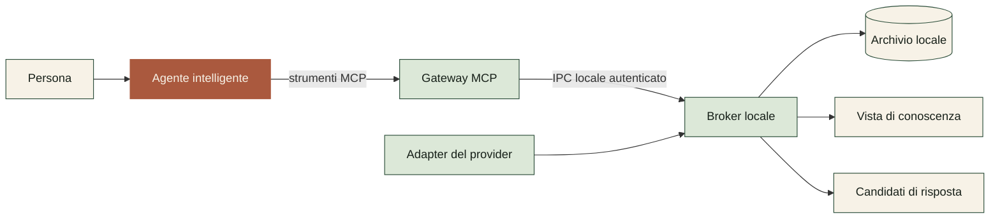
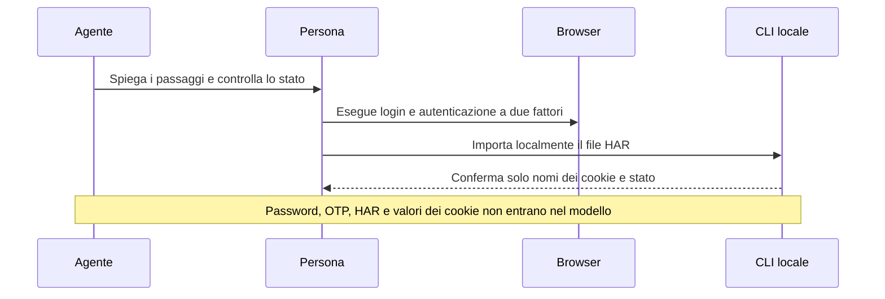

<div align="center">
  

# Work Assistant

  

**La posta diventa un archivio locale utilizzabile da una persona o da un agente intelligente.**

Indipendente dal provider · Più caselle · CLI · MCP · Revisione umana

[Inizia dalla demo](#prova-la-demo) · [Collega un agente](#usa-work-assistant-con-un-agente) · [Comprendi la sicurezza](#come-protegge-i-dati) · [Stato del progetto](#stato-del-progetto)
</div>

---


## Che cos'è Work Assistant

Work Assistant è un sistema locale per organizzare e usare la posta elettronica con strumenti intelligenti.

Il sistema acquisisce messaggi da una o più caselle, li normalizza e li conserva in un archivio SQLite locale. Da questo archivio ricostruisce una vista di contatti e interazioni. Una persona può usare il sistema dalla riga di comando. Un agente, come Codex o Claude, può usarlo tramite il protocollo MCP.

Work Assistant non è un client di posta tradizionale e non è una semplice skill:

- il **core** gestisce account, archivio, controlli e contenuti proposti;
- la **CLI** permette a una persona di usare il core senza un modello;
- il **server MCP** offre strumenti strutturati agli agenti;
- la **skill** insegna all'agente come usare questi strumenti entro i limiti autorizzati;
- un **adapter** collega uno specifico servizio email al core.

Il core pubblico non invia email. Le risposte preparate restano candidati locali fino a un'eventuale azione separata e autorizzata.


| Capacità | Che cosa significa |
| --- | --- |
| Memoria locale | I messaggi normalizzati restano sul computer e conservano hash di integrità. |
| Superficie per agenti | MCP espone comandi tipizzati senza consegnare al gateway l'accesso diretto all'archivio. |
| Controllo umano | Il core pubblico prepara contenuti locali, ma non espone un comando di invio. |

## Perché esiste

Una casella contiene più di singoli messaggi. Contiene conversazioni, persone, allegati, decisioni e attività ancora aperte. I normali client mostrano bene la posta corrente, ma rendono difficile riusare questa storia come conoscenza operativa.

Work Assistant separa tre livelli:

1. **Archivio locale**: conserva ciò che è stato acquisito e ne controlla l'integrità.
2. **Vista di conoscenza**: ricostruisce contatti e interazioni dall'archivio. È derivata e può essere rigenerata.
3. **Superficie agente**: permette a un modello di cercare, leggere e preparare contenuti tramite operazioni controllate.

La vista di conoscenza non è la fonte originale e non costituisce, da sola, un backup verificato. Un vero backup richiede anche copia, conservazione, controllo e prova di ripristino.

## Come funziona



Il broker è il confine di fiducia. Legge i dati in chiaro, applica la regola di pseudonimizzazione e restituisce al gateway solo uno schema dichiarato. Gli identificativi del provider diventano riferimenti opachi. I metadati non riconosciuti non attraversano il confine.

## Prova la demo

La demo usa solo identità e messaggi sintetici. Non richiede credenziali né una casella reale.

### Requisiti

- Python 3.11 o successivo;
- Git;
- macOS, Linux o Windows.

### 1. Installa il progetto

```bash
git clone https://github.com/Wulfgardr/work-assistant.git
cd work-assistant
python3 -m venv .venv
```

Attiva l'ambiente su macOS o Linux:

```bash
source .venv/bin/activate
```

Su Windows PowerShell:

```powershell
.venv\Scripts\Activate.ps1
```

Installa Work Assistant:

```bash
python -m pip install .
```

### 2. Crea la configurazione

```bash
work-assistant --config work-assistant.toml init
```

Il comando inserisce una cartella dati specifica del sistema operativo. Archivio, chiavi e registro delle identità non vengono collocati nel repository.

### 3. Carica le caselle sintetiche

```bash
work-assistant --config work-assistant.toml sync --account personal
work-assistant --config work-assistant.toml sync --account team
work-assistant --config work-assistant.toml list
work-assistant --config work-assistant.toml knowledge
work-assistant --config work-assistant.toml verify
```

Il comando `verify` controlla l'integrità di SQLite e gli hash dei messaggi. Non dimostra che un backup possa essere ripristinato.

## Usa Work Assistant con un agente

Codex, Claude e altri client MCP usano la stessa superficie. Il modello non è incorporato nella CLI.

Installa il supporto MCP:

```bash
python -m pip install '.[mcp]'
```

### 1. Avvia il broker locale

Apri un terminale locale attendibile e avvia:

```bash
work-assistant --config work-assistant.toml broker
```

Il broker deve rimanere attivo. Se non è disponibile, il gateway MCP si arresta senza leggere direttamente l'archivio.

In un secondo terminale, recupera i due percorsi necessari:

```bash
work-assistant --config work-assistant.toml broker-info
```

### 2. Registra il server in Codex

Sostituisci i due segnaposto con i valori di `broker-info`:

```bash
codex mcp add work-assistant -- \
  "$PWD/.venv/bin/work-assistant" \
  mcp \
  --broker-address '<BROKER_ADDRESS>' \
  --broker-auth-file '<BROKER_AUTH_FILE>'
```

Su Windows usa `.venv\Scripts\work-assistant.exe`.

Esempio di richiesta:

> Usa Work Assistant. Controlla la modalità di riservatezza, sincronizza la casella `personal`, mostrami gli ultimi messaggi e prepara un candidato di risposta. Non inviare nulla.

La skill facoltativa si trova in [`skills/work-assistant`](skills/work-assistant). La skill aggiunge regole operative, ma non sostituisce il server MCP.

### 3. Registra il server in Claude Code

```bash
claude mcp add work-assistant -- \
  "$PWD/.venv/bin/work-assistant" \
  mcp \
  --broker-address '<BROKER_ADDRESS>' \
  --broker-auth-file '<BROKER_AUTH_FILE>'
```

Per Claude Desktop, configura un server `stdio` equivalente:

```json
{
  "mcpServers": {
    "work-assistant": {
      "command": "/percorso/assoluto/work-assistant/.venv/bin/work-assistant",
      "args": [
        "mcp",
        "--broker-address",
        "<BROKER_ADDRESS>",
        "--broker-auth-file",
        "<BROKER_AUTH_FILE>"
      ]
    }
  }
}
```

## Usa la CLI senza un agente

La CLI è deterministica: non contiene un modello e non interpreta richieste in linguaggio naturale.

```bash
work-assistant --config work-assistant.toml list --account personal --limit 10
work-assistant --config work-assistant.toml show --account personal --id p-001
```

Per salvare un candidato di risposta locale:

```bash
printf 'Grazie. Verifico il documento entro venerdì.\n' > risposta.txt
work-assistant --config work-assistant.toml draft-candidate \
  --account personal \
  --to sam@example.test \
  --subject 'Re: Revisione del progetto' \
  --in-reply-to p-001 \
  --body-file risposta.txt
```

La risposta include `sent: false`. Nessun contenuto viene scritto sul provider.

Un agente con accesso a un terminale deve usare MCP. Non deve leggere direttamente SQLite né l'output in chiaro della CLI.

## Configura più caselle

Ogni tabella sotto `[accounts]` descrive una casella indipendente:

```toml
schema_version = 1
data_dir = "/percorso/esterno/al/repository"

[privacy]
mode = "all"
default_action = "pseudonymize"

[accounts.personal]
provider = "demo"
source = "./examples/demo-mailbox.jsonl"
address = "alex@example.test"

[accounts.team]
provider = "demo"
source = "./examples/team-mailbox.jsonl"
address = "team@example.test"
```

Il repository include solo l'adapter dimostrativo. Gli adapter reali devono implementare il contratto descritto in [`docs/PROVIDER_ADAPTERS.md`](docs/PROVIDER_ADAPTERS.md).

### Zimbra e Carbonio

La versione pubblica include un onboarding locale per preparare una sessione Zimbra o Carbonio da un file HAR. L'adapter Zimbra operativo non è incluso.



Il comando locale è:

```bash
work-assistant --config work-assistant.toml import-zimbra-har \
  --account work \
  --har /percorso/locale/session.har
```

Il comando non elimina il file HAR. Dopo la verifica, sposta o elimina l'esportazione con una procedura adeguata al suo contenuto sensibile.

## Come protegge i dati

Work Assistant offre tre modalità:

| Modalità | Comportamento |
| --- | --- |
| `off` | Nessuna trasformazione. Il contenuto visibile all'agente può raggiungere il fornitore del modello. |
| `all` | Pseudonimizza gli identificativi strutturati e il testo riconosciuto. È il valore della configurazione di esempio. |
| `selective` | Applica regole ordinate per mittente. La prima regola corrispondente prevale. |

Esempio di regole selettive:

```toml
[privacy]
mode = "selective"
default_action = "pseudonymize"

[[privacy.sender_rules]]
pattern = "newsletter@example.test"
action = "allow_raw"

[[privacy.sender_rules]]
pattern = "*@sensitive.example"
action = "pseudonymize"
```

La risposta dell'agente contiene solo un identificativo opaco della regola, non il suo valore letterale.

Il registro facoltativo delle identità si trova, per impostazione predefinita, in `<data_dir>/privacy/entities.json`. Su sistemi POSIX deve appartenere all'utente e avere permessi `0600`.

La pseudonimizzazione è reversibile e non garantisce anonimato. Fatti rari, contesto, stile di scrittura o termini non riconosciuti possono identificare una persona.

Perché il broker costituisca un confine reale, la cartella dati deve restare fuori da ogni workspace leggibile dall'agente. Il broker rifiuta questa configurazione, salvo un override esplicito e non sicuro destinato alle sole demo controllate.

Leggi [`SECURITY.md`](SECURITY.md) prima di usare messaggi reali.

## Revisione di sicurezza Daybreak

Il 24 agosto 2026 una revisione Daybreak ha analizzato il broker, la pseudonimizzazione, l'IPC e la superficie MCP. La revisione ha rilevato sette problemi: uno di gravità media e sei di gravità bassa.

La versione `0.3.0` applica queste correzioni:

- dati e chiavi fuori dal repository per impostazione predefinita;
- rifiuto del broker quando il deposito protetto ricade nel workspace dell'agente;
- registro delle identità esterno e con controllo dei permessi;
- schema MCP a lista chiusa, riferimenti opachi e metadati del provider esclusi;
- identificativi opachi per le regole selettive;
- numero fisso di worker e scadenza per le connessioni inattive;
- timeout complessivo su connessione, autenticazione, richiesta e risposta.

Il rapporto, le prove e i limiti residui sono in [`docs/security/DAYBREAK-REVIEW.md`](docs/security/DAYBREAK-REVIEW.md).

## Backup e ripristino

Work Assistant conserva messaggi normalizzati e relativi hash. Questo rende l'archivio controllabile, ma non lo rende automaticamente un backup resiliente.

Per dichiarare un backup verificato devi definire e provare:

- quali messaggi e allegati vengono inclusi;
- cifratura e gestione delle chiavi;
- frequenza, conservazione e versioni;
- verifica degli hash;
- procedura di ripristino in un ambiente isolato;
- confronto tra contenuto atteso e contenuto ripristinato.

La funzione `verify` controlla l'archivio corrente. Non esegue un ripristino.

## Stato del progetto

Work Assistant è un progetto **alpha**.

Disponibile:

- core indipendente dal provider;
- configurazione multi-casella;
- adapter demo sintetico;
- archivio SQLite con hash;
- vista locale di contatti e interazioni;
- CLI;
- gateway MCP e broker locale;
- pseudonimi reversibili;
- skill per agenti;
- onboarding preparatorio Zimbra e Carbonio.

Non disponibile:

- adapter di produzione per provider reali;
- invio di email;
- prova completa di backup e ripristino;
- pseudonimizzazione del contenuto binario degli allegati;
- garanzia di anonimato.

## Sviluppo e contributi

```bash
python -m pip install '.[dev,mcp]'
pytest
python scripts/privacy_check.py
work-assistant benchmark-privacy --iterations 50
```

Usa solo dati sintetici in codice, test, screenshot, issue e pull request. Leggi [`CONTRIBUTING.md`](CONTRIBUTING.md) per le regole del progetto.

## Licenza

Work Assistant è distribuito con licenza [MIT](LICENSE).
