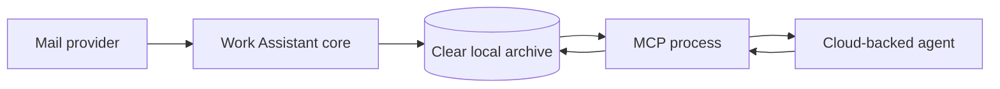
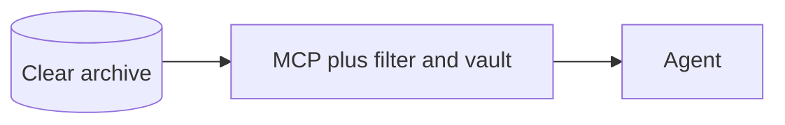
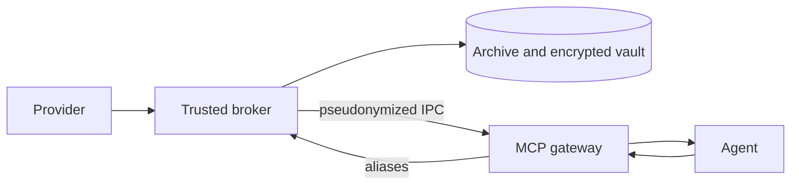
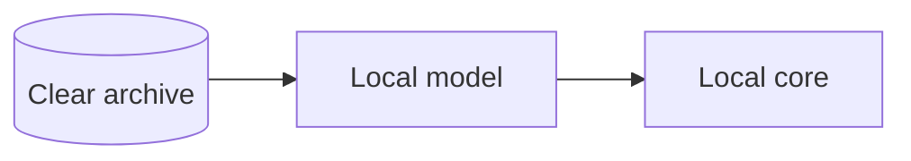

# Security Hardening Proposal: Agent privacy boundary

## Decision

Selected: Option 2, an isolated local broker with configurable pseudonymization.

## Executive Recommendation

We considered three options: Option 1 adds an inline filter to the current MCP process; Option 2 moves clear data and restoration into an isolatable broker; Option 3 uses only a local model. The user selected Option 2 with `off`, `all` and `selective` modes. I recommend that choice for cloud-model compatibility because it creates a meaningful boundary when the broker data directory is not readable by the agent.

## Evidence

I inspected the current source at `ffdd499`. The decisive evidence is that the same MCP process can read the clear archive and return its content.

| Evidence | Source | What it establishes |
| --- | --- | --- |
| `E001` — Raw MCP responses | `src/work_assistant/mcp_server.py` | Addresses, subjects and bodies cross the agent boundary directly. |
| `E002` — Clear local archive | `src/work_assistant/archive.py` | Clear storage is intentional and needed for local reconstruction. |
| `E003` — No privacy policy | `src/work_assistant/config.py` | No deterministic sender or entity policy exists. |
| `E004` — Direct agent usage | `README.md` | Agent setup points to the same MCP process. |
| `E005` — No isolation contract | `SECURITY.md` | Existing guidance does not prevent agent filesystem access. |

## Current Design And Failure Mode

The archive is local, which is valuable, but locality alone does not control model exposure. When an MCP tool returns a message, the client may send that content to a cloud model. An inline replacement table reduces routine disclosure, but an agent with shell access can read the database and table directly. Sender-only filtering also misses cross-references: an allowed newsletter can name a protected correspondent.

## Desired Invariants

- The agent-facing gateway cannot read the clear archive or alias key.
- Stable aliases preserve co-reference inside one workspace without being portable to another workspace.
- The broker restores only aliases issued by its authenticated vault.
- Every response discloses whether its policy action was `pseudonymize` or `allow_raw`.
- Global entity rules apply even when a sender rule allows raw content.
- Unknown, malformed or foreign aliases block local draft reconstruction.

## Constraints And Non-Goals

This design does not claim irreversible anonymization. Text can remain identifying through rare facts, writing style or unmatched names. Encryption of the alias vault protects integrity and accidental file exposure; it does not replace OS isolation. The first release does not attempt statistical disclosure control or automatic clinical de-identification.

## Before Architecture

The current process holds both the raw record and the agent connection.

## Options

### Option 1: Inline pseudonymization filter

The attractive part is the small migration: one process can transform MCP responses and restore draft text. It protects against accidental payload inclusion and keeps latency low. What gives me pause is that it does not remove authority. A shell-capable agent can bypass the filter by reading the archive or key.

| Change | Before | After | Security consequence | Cost |
| --- | --- | --- | --- | --- |
| Response mapping | None | Inline aliases | Reduces routine disclosure | Matching and vault lookup |
| Authority | MCP reads everything | MCP still reads everything | Bypass remains | Minimal migration |

Rollback is a configuration change to `off`. This option should win only when the agent is already prevented from reading local files by another trusted sandbox.

### Option 2: Isolated local broker

The broker owns providers, archive, policy, vault and restoration. The MCP gateway receives a safe protocol containing aliases and counts, never raw storage handles. This is the only cloud-compatible option here that can become a real security boundary. It becomes effective only when deployment places broker files outside the agent-readable workspace, ideally under a separate OS identity or container volume.

IPC, policy evaluation and authenticated encryption add work, but each operation is local and linear in the content transformed. We should not call the impact negligible until measured. The new reliability cost is clearer: if the broker is unavailable, the gateway must fail closed instead of falling back to raw access.

| Change | Before | After | Security consequence | Cost |
| --- | --- | --- | --- | --- |
| Raw-data owner | MCP process | Broker only | Gateway loses raw authority | Extra process |
| Draft reconstruction | MCP writes clear text | Broker validates and restores aliases | Foreign aliases fail closed | IPC dependency |
| Policy | None | `off`, `all`, `selective` plus global entities | Exposure becomes explicit | Configuration and tests |

Rollout can begin with demo data and `selective` mode, then move to `all`. Rollback stops the gateway and broker and restores the previous command; it must never silently switch privacy mode to `off`.

### Option 3: Local-model-only processing

This removes routine cloud egress and may eventually be the cleanest experience. It does not remove the need for local permissions, logging controls or plugin governance, and it ties quality and latency to local hardware. It becomes preferable when a qualified local model meets task quality, language and memory requirements.

| Change | Before | After | Security consequence | Cost |
| --- | --- | --- | --- | --- |
| Inference | Cloud-capable | Local only | Removes normal cloud disclosure | Hardware and model operations |

## Comparison

| Dimension | Option 1: Inline | Option 2: Broker | Option 3: Local model |
| --- | --- | --- | --- |
| Security boundary | Weak without sandbox | Strong with OS isolation | Removes cloud egress |
| Latency | Lowest expected | Local IPC plus transform | Hardware-dependent |
| Memory | One alias cache | Broker plus gateway | Model-dependent, potentially high |
| Reliability | Simple | Broker availability required | Model runtime required |
| Operations | Minimal | Supervision and isolation | Model distribution and updates |
| Migration | Small | Moderate | Largest product change |

## Recommendation

I recommend Option 2 under the current requirement to support Codex and Claude. Option 1 is acceptable only as defense in depth behind an existing filesystem sandbox. Option 3 becomes preferable when a local model is independently qualified.

## Evidence Coverage And Residual Risk

| Evidence | Effect | Residual risk |
| --- | --- | --- |
| `E001` — Raw MCP responses | Addressed by safe broker protocol | `allow_raw` deliberately exposes selected content. |
| `E002` — Clear local archive | Mitigated by process and filesystem isolation | Local administrators can still access the archive. |
| `E003` — No privacy policy | Addressed by explicit modes and ordered rules | Misconfiguration can disclose content. |
| `E004` — Direct agent usage | Addressed by gateway-only agent setup | Shell access to broker storage defeats the boundary. |
| `E005` — No isolation contract | Addressed in deployment guidance | Platform-specific isolation recipes require validation. |

Rare facts, free-text identifiers and stylistic fingerprints can re-identify a message even after entity replacement. The UI and documentation must call the feature pseudonymization, not anonymization.

## Migration And Rollout

Introduce the policy and vault with synthetic fixtures, add the broker protocol, then point agent configuration at the gateway. Existing users start with `off`; the public example uses `all`. `selective` supports explicit sender patterns. No failure may downgrade privacy automatically.

## Validation Plan

- Verify structured address, email, phone and registry replacements.
- Verify stable aliases within a workspace and different aliases across workspaces.
- Fuzz malformed and foreign aliases during draft restoration.
- Test `off`, `all`, first-match sender rules and global entity rules.
- Attempt raw archive access from the documented agent sandbox.
- Benchmark direct, `allow_raw` and pseudonymized paths with synthetic messages.
- Kill the broker during calls and verify fail-closed errors.

## Implementation Work Packages

1. Policy schema and deterministic sender evaluation.
2. Authenticated encrypted alias vault and entity registry.
3. Safe broker protocol with no raw read endpoint.
4. MCP gateway client and fail-closed startup.
5. Synthetic benchmark, deployment guides and regression suite.

## Open Questions

- Which separate-user or container recipe should be the first fully supported deployment?
- Should attachment content pseudonymization wait for a typed extraction pipeline?

