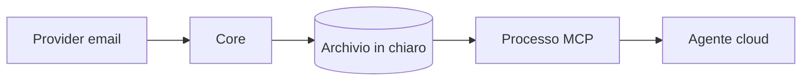
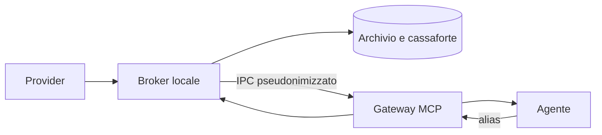

# Proposta di hardening: confine tra agente e dati

## Decisione

La soluzione scelta è un broker locale isolabile con pseudonimizzazione configurabile.

## Sintesi

Sono state considerate tre opzioni:

1. filtro nello stesso processo MCP;
2. broker locale separato;
3. uso esclusivo di un modello locale.

La seconda opzione supporta Codex e Claude e può creare un confine reale se la cartella dati non è leggibile dall'agente.

## Problema iniziale

Il processo MCP possedeva sia il record in chiaro sia la connessione con l'agente.

La collocazione locale dell'archivio non controlla, da sola, ciò che il client invia al modello.

## Invarianti desiderati

- Il gateway non legge archivio o chiave in chiaro.
- Gli alias restano stabili in una sola installazione.
- Il broker ripristina solo alias emessi dalla propria cassaforte.
- Ogni risposta dichiara `pseudonymize` o `allow_raw`.
- Le regole globali si applicano anche ai mittenti consentiti in chiaro.
- Alias sconosciuti o non validi bloccano il ripristino locale.

## Opzione 1: filtro nello stesso processo

Un filtro in linea richiede poche modifiche e riduce le esposizioni accidentali. Non elimina però l'autorità del processo MCP sui dati in chiaro.

Questa opzione è adeguata solo quando un sandbox affidabile impedisce già all'agente di leggere i file locali.

## Opzione 2: broker locale isolabile

Il broker possiede provider, archivio, regole, cassaforte e ripristino. Il gateway riceve un protocollo ridotto con alias, conteggi e riferimenti opachi.

Il broker aggiunge un processo e una dipendenza IPC. Se non è disponibile, il gateway deve fermarsi senza usare dati in chiaro.

## Opzione 3: solo modello locale

Un modello locale elimina la normale uscita dei dati verso un modello cloud. Restano necessari permessi locali, controllo dei log e governo dei plugin. Qualità e tempi dipendono dall'hardware e dal modello scelto.

## Confronto

| Dimensione | Filtro in linea | Broker locale | Modello locale |
| --- | --- | --- | --- |
| Confine di sicurezza | Debole senza sandbox | Forte con isolamento | Elimina l'uscita cloud ordinaria |
| Latenza | Attesa più bassa | IPC e trasformazione locali | Dipende dall'hardware |
| Affidabilità | Un solo processo | Il broker deve essere disponibile | Il modello deve essere disponibile |
| Migrazione | Piccola | Moderata | Ampia |

## Rischi residui

- `allow_raw` espone deliberatamente il contenuto selezionato.
- Un amministratore locale può leggere l'archivio.
- Un agente con accesso alla cartella dati annulla il confine.
- Fatti rari e stile possono identificare un testo pseudonimizzato.
- Il contenuto binario degli allegati richiede una pipeline separata.

## Piano di verifica

- provare indirizzi, email, telefoni e registro globale;
- verificare alias stabili e diversi tra installazioni;
- rifiutare alias alterati o estranei;
- provare tutte le modalità e la prima regola corrispondente;
- tentare l'accesso dal workspace dell'agente;
- misurare il percorso sintetico;
- interrompere il broker e verificare l'errore fail-closed.
